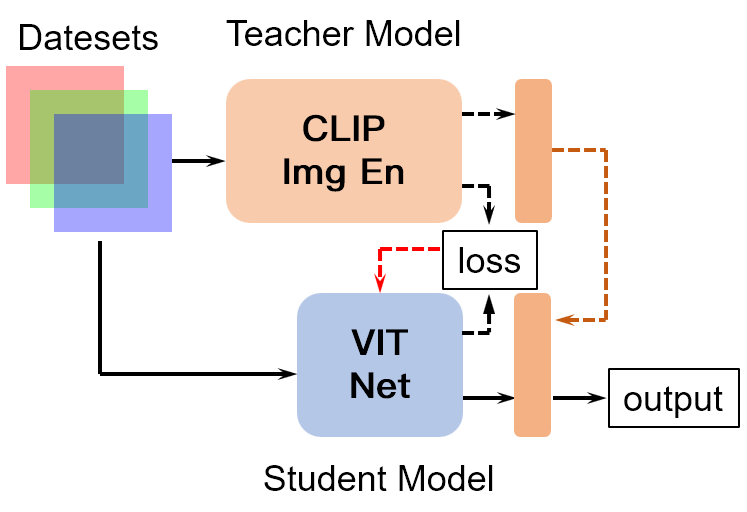

# Knowledge-Distillation-of-CLIP-Image-Encoder
Distillate the CLIP Image Encoder to a ViT Network

# System architecture

 
The overall architecture is shown in the figure above. The image encoder of CLIP is distilled into a small ViT architecture. Here, the features before the classification layer are distilled, using the MSE loss. The teacher and student models can each train their own classification networks.

# Usage
<pre lang="no-highlight"><code>```python
def greet(name):
    print(f"Hello, {name}!")

greet("Alice")
```
</code></pre>